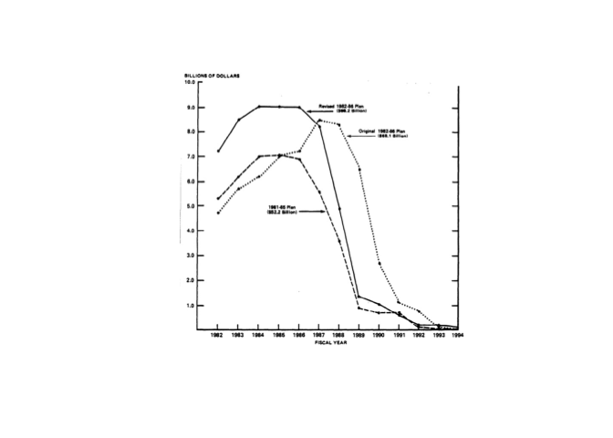
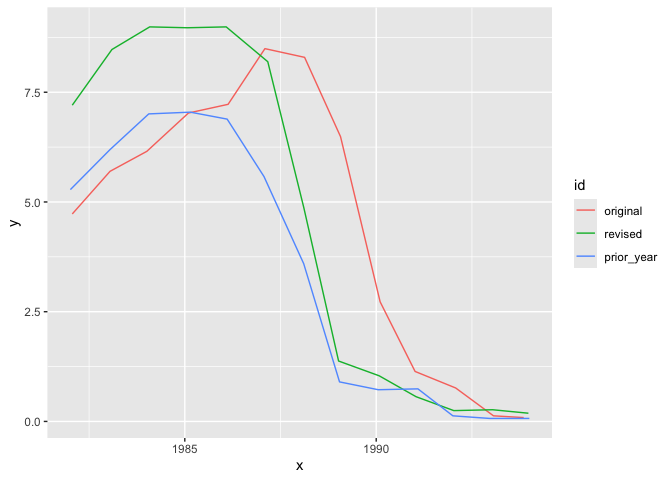
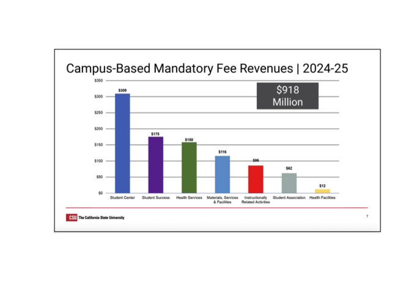

# 4: Extract data from graphics


## Extracting data from static graphics

Sometimes government agencies, researchers and other sources publish
static data visualizations without releasing the underlying data behind
them. If you want to do your own analysis, it can be helpful to have a
way to turn visual information into tabular data. That’s where the R
package `metaDigitise` comes in handy.

> If you’re following along from your own laptop, don’t forget to run
> `install.packages("metaDigitise")`.

## Example: U.S. Army spending on weapons

Back in 1981, the internal watchdogs at the GAO, then called the U.S.
General Accounting Office, [released a
report](https://www.gao.gov/assets/masad-82-5.pdf) on the cost of new
weapons systems. They reported the following:

> The Army is now facing the problem of funding the procurement of all
> 14 of its new major weapons systems. Recent experience has shown that
> as new Army weapons begin production, procurement costs run
> considerably higher than anticipated.

To illustrate that point, the report contains the following static data
visualization comparing how the procurement funding plans have grown
more expensive:



We can use
[metaDigitise](https://github.com/daniel1noble/metaDigitise/tree/master?tab=readme-ov-file#example-of-how-it-works-)
to trace both lines and reproduce the same graphic.

``` r
library(metaDigitise)
dir_vis <- here::here("sample-vis/")
# Copy this line into the console; don't run it in this .qmd file
# metaDigitise(dir = dir_vis)
# You can also re-open and keep editing an existing extraction like this
# metaDigitise(dir = dir_vis, summary = FALSE)
```

Here’s what the final product looks like.

``` r
library(ggplot2)

file_fig_1_data <- here::here("sample-vis/caldat/fig_1")
fig_1_data <- readr::read_rds(file_fig_1_data)

fig_1_data$processed_data |> 
  ggplot(aes(x = x, y = y, group = id, color = id)) +
  geom_line()
```



# Example: University fees

You can also use `metaDigitise` to process box plots, mean and error
bars and histograms as well as scatter plots. Consider this depiction of
[revenue from college student
fees](https://www.calstate.edu/csu-system/board-of-trustees/MeetingHandouts/January%2026-28,%202026/FIN%20Item%203%20-%202025-26%20Student%20Fee%20Report%20-%20HANDOUT%20BOTv1.pdf)
at California State University.



If the bars weren’t labeled, could you use `metaDigitise` to estimate
their heights? If we have a few minutes, we can fire up`metaDigitise`
and give it a try.

``` r
# Copy this line into the console; don't run it in this .qmd file
# metaDigitise(dir = dir_vis)
```
