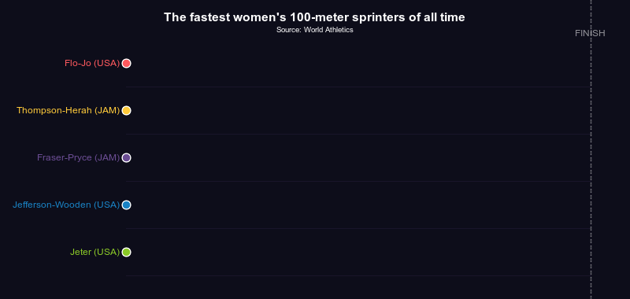

# 6: Create animated data visualizations


## Turning your data visuals into animated gifs

This one is just for fun. R might not be your go-to tool for making
animated gifs. But you can!

Consider this New York Times graphic:


On a whim, I asked Claude to create a similar graphic using the R
library `magick` and data on the [fastest female 100-meter
sprinters](https://worldathletics.org/records/all-time-toplists/sprints/100-metres/outdoor/women/senior).
I’ve tweaked the code just a little, but here’s what it came up with – a
minimal viable product that you could easily refine for publication.

## A quick vibe-coded example

``` r
library(magick)
```

    Linking to ImageMagick 6.9.13.29
    Enabled features: cairo, fontconfig, freetype, heic, lcms, pango, raw, rsvg, webp
    Disabled features: fftw, ghostscript, x11

``` r
library(purrr)

# ── Data from World Athletics all-time top list ────────────────────────────────
# Time in seconds; lower = faster. We animate progress toward 100m finish line.
sprinters <- 
  tibble::tribble(
  ~name,                      ~time,  ~country, ~year,
  "Flo-Jo",                   10.49,  "USA",    1988,
  "Thompson-Herah",           10.54,  "JAM",    2021,
  "Fraser-Pryce",             10.60,  "JAM",    2021,
  "Jefferson-Wooden",         10.61,  "USA",    2025,
  "Jeter",                    10.64,  "USA",    2009
)

# ── Colors ───────────────────────────────────────────────────────────────────
cols <- c(
  "#FF595E", "#FFCA3A", "#6A4C93", "#1982C4", "#8AC926"
)

# ── Layout constants ──────────────────────────────────────────────────────────
W            <- 800
H            <- 380
MARGIN_LEFT  <- 160
MARGIN_RIGHT <- 50
MARGIN_TOP   <- 50
MARGIN_BOTTOM <- 30
N_FRAMES     <- 60
N            <- nrow(sprinters)
LANE_H       <- (H - MARGIN_TOP - MARGIN_BOTTOM) / N

# Map distance (0–100) → x pixel
to_x <- function(d) MARGIN_LEFT + (d / 100) * (W - MARGIN_LEFT - MARGIN_RIGHT)

# ── Compute per-frame positions ───────────────────────────────────────────────
# Each sprinter runs at a speed proportional to their actual time.
# We normalize so the world-record holder finishes exactly at frame N_FRAMES.
max_time  <- max(sprinters$time)
min_time  <- min(sprinters$time)

# speed_ratio: 1 = fastest, <1 = slower
sprinters$speed <- min_time / sprinters$time

# positions[[i]] = numeric vector of length N_FRAMES, values 0–100
positions <- map(sprinters$speed, function(spd) {
  pmin(seq(0, 100 / spd, length.out = N_FRAMES) * spd, 100)
})

# ── Build one frame ───────────────────────────────────────────────────────────
make_frame <- function(frame_i) {
  
  # Here's where we use magick to create a canvas
  img <- 
    image_blank(width = W, height = H, color = "#0D0D1A") |> 
    image_draw()

  # Title
  text(
    x = W / 2, 
    y = 22,
    labels = "The fastest women's 100-meter sprinters of all time",
    col = "white", 
    cex = 1.3, 
    font = 2, 
    adj = 0.5
  )
  
  # Subtitle
  text(
    x = W / 2, 
    y = 38, 
    labels = "Source: World Athletics",
    col = "white", 
    cex = 0.8, 
    adj = 0.5
  )

  # Finish line
  abline(v = to_x(100), col = "#ffffff44", lwd = 1.5, lty = 2)
  text( 
    x = to_x(100), 
    y = MARGIN_TOP - 8, 
    labels = "FINISH", 
    col = "#ffffff88",
    cex = 1, 
    adj = 0.5
  )

  # Draw each lane
  walk2(seq_len(N), cols, function(i, col) {
    # For every sprinter, draw a sprinting lane, label the athlete,
    # and create a dot (sprinter) and trail (progress bar)
    pos   <- positions[[i]][frame_i]
    x     <- to_x(pos)
    y_mid <- MARGIN_TOP + (i - 0.5) * LANE_H

    # Lane separator
    segments(MARGIN_LEFT, y_mid + LANE_H / 2,
             W - MARGIN_RIGHT, y_mid + LANE_H / 2,
             col = "#ffffff11", lwd = 1)

    # Athlete label (left)
    text(
      x = MARGIN_LEFT - 8, 
      y = y_mid,
      labels = paste0(sprinters$name[i], " (", sprinters$country[i], ")"),
      col = col, 
      cex = 1 ,
      adj = 1
    )

    # Trail
    if (frame_i > 1) {
      segments(to_x(0), y_mid, x, y_mid,
               col = paste0(col, "44"), lwd = 4)
    }

    # Dot
    points(x, y_mid, pch = 21, bg = col, col = "white",
           cex = 2, lwd = 1.5)

    # Time label (shown when near finish)
    if (pos > 75) {
      text(
        x = x + 14, 
        y = y_mid,
        labels = paste0(sprinters$time[i], "s"),
        col = col, 
        cex = 1,
        adj = 0
      )
    }
  })

  dev.off()
  img
}

# ── Render all frames with purrr::map ────────────────────────────────────────
frames <- map(seq_len(N_FRAMES), make_frame)

# ── Assemble and save ─────────────────────────────────────────────────────────
animation <- image_join(frames)
animation <- image_animate(animation, fps = 10, loop = 0)
animation
```



## More to explore

[Lena Groeger](https://www.propublica.org/people/lena-groeger), the
graphics director at ProPublica, has a great collection of [data visuals
that are animated gifs](https://lenagroeger.com/datagifs/#/). That’s
where I found the swimmers example mentioned above.
