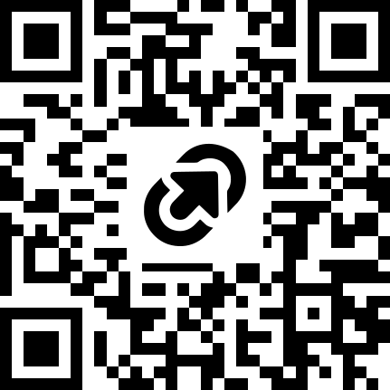

# 10 things you didn’t know you could do in R

R is great for quick data exploration, visualization and spatial analysis. But did you know you can extract text from images, send customized emails and chat with PDFs all without ever leaving the cozy comfort of R?

In this session, we'll zip through a few lesser-known or relatively new R packages for working with large language models, media and databases. 

Though pitched at intermediate users interested in getting more mileage out of R, this demo will also give beginners a taste of what's possible. 

## Take the survey

Show off some of the unusual, unexpected or plain obscuRe (sorry) ways you use R in your newsroom: https://tinyurl.com/10-things-R 

I'll circulate the results in a tip sheet after the session.

